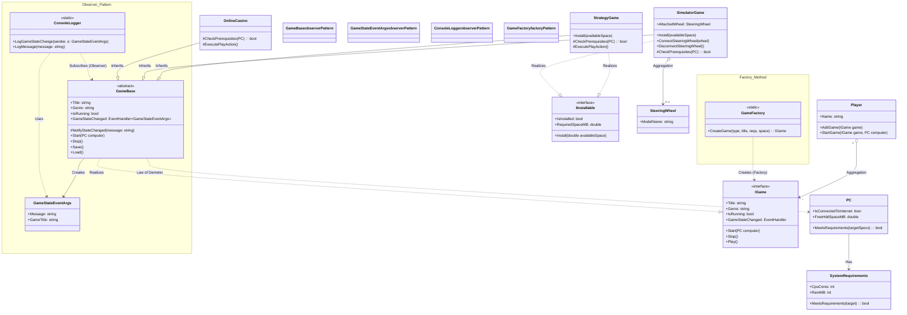

### UML Діаграма класів (Лабораторна 1.3)

```mermaid
classDiagram
    %% --- СТИЛІ ДЛЯ ПАТЕРНІВ ПРОЕКТУВАННЯ ---
    classDef observerPattern fill:#ffeef0,stroke:#cc0000,stroke-width:2px,stroke-dasharray: 5 5
    classDef factoryPattern fill:#eef2ff,stroke:#0033cc,stroke-width:2px,stroke-dasharray: 5 5

    %% --- ГРУПУВАННЯ ПАТЕРНІВ (СТВОРЮЄ РАМКИ З ПІДПИСАМИ) ---
    namespace Observer_Pattern {
        class GameBase
        class GameStateEventArgs
        class ConsoleLogger
    }

    namespace Factory_Method {
        class GameFactory
    }

    %% --- ІНТЕРФЕЙСИ ---
    class IGame {
        <<interface>>
        +Title: string
        +Genre: string
        +IsRunning: bool
        +GameStateChanged: EventHandler
        +Start(PC computer)
        +Stop()
        +Play()
    }

    class IInstallable {
        <<interface>>
        +IsInstalled: bool
        +RequiredSpaceMB: double
        +Install(double availableSpace)
    }

    %% --- СУТНОСТІ ПАТЕРНІВ ---
    class GameStateEventArgs {
        +Message: string
        +GameTitle: string
    }

    class ConsoleLogger {
        <<static>>
        +LogGameStateChange(sender, e: GameStateEventArgs)
        +LogMessage(message: string)
    }

    class GameBase {
        <<abstract>>
        +Title: string
        +Genre: string
        +IsRunning: bool
        +GameStateChanged: EventHandler~GameStateEventArgs~
        #NotifyStateChanged(message: string)
        +Start(PC computer)
        +Stop()
        +Save()
        +Load()
    }

    class GameFactory {
        <<static>>
        +CreateGame(type, title, reqs, space): IGame
    }

    %% --- ІГРИ ---
    class StrategyGame {
        +Install(availableSpace)
        #CheckPrerequisites(PC): bool
        #ExecutePlayAction()
    }

    class SimulatorGame {
        +AttachedWheel: SteeringWheel
        +Install(availableSpace)
        +ConnectSteeringWheel(wheel)
        +DisconnectSteeringWheel()
        #CheckPrerequisites(PC): bool
    }

    class OnlineCasino {
        #CheckPrerequisites(PC): bool
        #ExecutePlayAction()
    }

    %% --- ІНШІ МОДЕЛІ ---
    class Player {
        +Name: string
        +AddGame(IGame game)
        +StartGame(IGame game, PC computer)
    }

    class PC {
        +IsConnectedToInternet: bool
        +FreeHddSpaceMB: double
        +MeetsRequirements(targetSpecs): bool
    }

    class SteeringWheel {
        +ModelName: string
    }

    class SystemRequirements {
        +CpuCores: int
        +RamMB: int
        +MeetsRequirements(target): bool
    }

    %% --- ЗАСТОСУВАННЯ СТИЛІВ ДО КЛАСІВ ---
    class GameBase observerPattern
    class GameStateEventArgs observerPattern
    class ConsoleLogger observerPattern
    class GameFactory factoryPattern

    %% --- ЗВ'ЯЗКИ (НАСЛІДУВАННЯ, РЕАЛІЗАЦІЯ, АГРЕГАЦІЯ) ---
    GameBase ..|> IGame : Realizes
    StrategyGame --|> GameBase : Inherits
    SimulatorGame --|> GameBase : Inherits
    OnlineCasino --|> GameBase : Inherits

    StrategyGame ..|> IInstallable : Realizes
    SimulatorGame ..|> IInstallable : Realizes

    Player "1" o--> "*" IGame : Aggregation
    SimulatorGame o--> "0..1" SteeringWheel : Aggregation
    PC --> SystemRequirements : Has

    %% --- ЗВ'ЯЗКИ ПАТЕРНІВ ---
    GameFactory ..> IGame : Creates (Factory)
    GameBase --> GameStateEventArgs : Creates
    ConsoleLogger ..> GameStateEventArgs : Uses
    ConsoleLogger ..> GameBase : Subscribes (Observer)

    GameBase ..> PC : Law of Demeter
```
