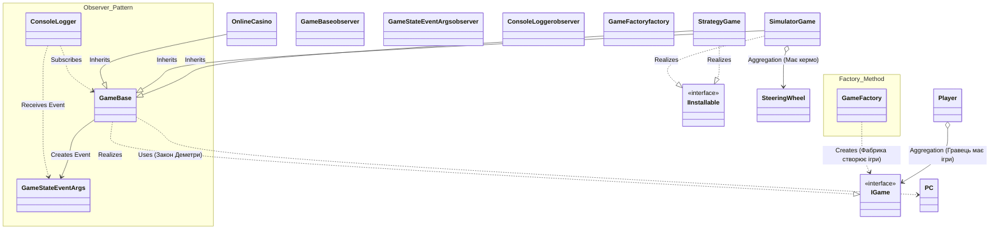

### Спрощена UML Діаграма архітектури (Лабораторна 1.2)

```mermaid
classDiagram
    %% --- СТИЛІ ДЛЯ ПАТЕРНІВ ПРОЕКТУВАННЯ ---
    classDef observer fill:#ffeef0,stroke:#cc0000,stroke-width:2px,stroke-dasharray: 5 5
    classDef factory fill:#eef2ff,stroke:#0033cc,stroke-width:2px,stroke-dasharray: 5 5

    %% --- ГРУПУВАННЯ ПАТЕРНІВ ---
    namespace Observer_Pattern {
        class GameBase
        class GameStateEventArgs
        class ConsoleLogger
    }

    namespace Factory_Method {
        class GameFactory
    }

    %% --- ІНТЕРФЕЙСИ ТА КЛАСИ (Без деталей) ---
    class IGame { <<interface>> }
    class IInstallable { <<interface>> }
    
    class StrategyGame
    class SimulatorGame
    class OnlineCasino
    class Player
    class PC
    class SteeringWheel

    %% --- ЗАСТОСУВАННЯ СТИЛІВ ---
    class GameBase observer
    class GameStateEventArgs observer
    class ConsoleLogger observer
    class GameFactory factory

    %% --- БАЗОВІ ЗВ'ЯЗКИ (ООП) ---
    GameBase ..|> IGame : Realizes
    StrategyGame --|> GameBase : Inherits
    SimulatorGame --|> GameBase : Inherits
    OnlineCasino --|> GameBase : Inherits

    StrategyGame ..|> IInstallable : Realizes
    SimulatorGame ..|> IInstallable : Realizes

    Player o--> IGame : Aggregation (Гравець має ігри)
    SimulatorGame o--> SteeringWheel : Aggregation (Має кермо)
    GameBase ..> PC : Uses (Закон Деметри)

    %% --- ЗВ'ЯЗКИ ПАТЕРНІВ ---
    GameFactory ..> IGame : Creates (Фабрика створює ігри)
    GameBase --> GameStateEventArgs : Creates Event
    ConsoleLogger ..> GameStateEventArgs : Receives Event
    ConsoleLogger ..> GameBase : Subscribes
```
