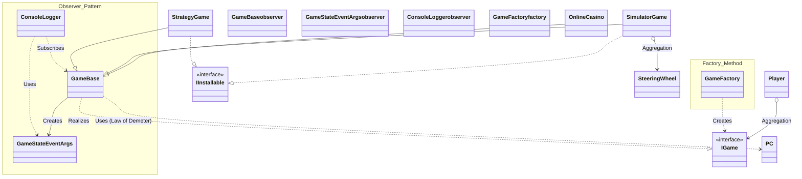

### UML Діаграма архітектури (Лабораторна 1.3)

```mermaid
%% Конфігурація для ЗБІЛЬШЕННЯ ШРИФТУ та компактності
%%{init: {"theme": "default", "themeVariables": { "fontSize": "18px", "fontFamily": "arial" }}}%%
classDiagram
    direction TB

    %% --- СТИЛІ ДЛЯ ПАТЕРНІВ ПРОЕКТУВАННЯ ---
    classDef observer fill:#fff3f3,stroke:#cc0000,stroke-width:3px,stroke-dasharray: 6 6
    classDef factory fill:#f0f5ff,stroke:#0033cc,stroke-width:3px,stroke-dasharray: 6 6

    %% --- ВИДІЛЕННЯ ПАТЕРНІВ РАМКАМИ (Вимога Лаб 1.3) ---
    namespace Observer_Pattern {
        class ConsoleLogger
        class GameStateEventArgs
        class GameBase
    }

    namespace Factory_Method {
        class GameFactory
    }

    %% --- БАЗОВІ СУТНОСТІ ---
    class IGame { <<interface>> }
    class IInstallable { <<interface>> }
    class StrategyGame
    class SimulatorGame
    class OnlineCasino
    class PC
    class Player
    class SteeringWheel

    %% --- ЗАСТОСУВАННЯ СТИЛІВ ДО КЛАСІВ ---
    class GameBase observer
    class GameStateEventArgs observer
    class ConsoleLogger observer
    class GameFactory factory

    %% --- 1. ЗВ'ЯЗКИ ПАТЕРНІВ ---
    GameFactory ..> IGame : Creates
    ConsoleLogger ..> GameBase : Subscribes
    ConsoleLogger ..> GameStateEventArgs : Uses
    GameBase --> GameStateEventArgs : Creates

    %% --- 2. НАСЛІДУВАННЯ ТА РЕАЛІЗАЦІЯ ---
    GameBase ..|> IGame : Realizes
    StrategyGame --|> GameBase
    SimulatorGame --|> GameBase
    OnlineCasino --|> GameBase

    StrategyGame ..|> IInstallable
    SimulatorGame ..|> IInstallable

    %% --- 3. АГРЕГАЦІЯ ТА ВИКОРИСТАННЯ (LoD) ---
    Player o--> IGame : Aggregation
    SimulatorGame o--> SteeringWheel : Aggregation
    GameBase ..> PC : Uses (Law of Demeter)
```
