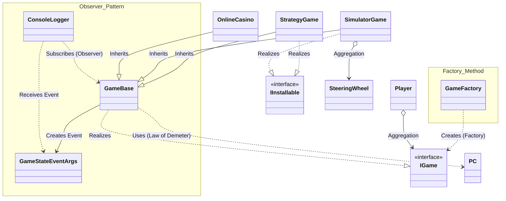

### UML Діаграма архітектури (Лабораторна 2)

```mermaid
classDiagram
    direction TB

    %% --- ПАТЕРНИ ПРОЕКТУВАННЯ (Виділені рамками згідно з Лаб 1.3) ---
    
    namespace Observer_Pattern {
        class ConsoleLogger
        class GameStateEventArgs
        class GameBase
    }

    namespace Factory_Method {
        class GameFactory
    }

    %% --- ІНТЕРФЕЙСИ ТА СУТНОСТІ ---
    
    class IGame {
        <<interface>>
    }
    class IInstallable {
        <<interface>>
    }
    
    class StrategyGame
    class SimulatorGame
    class OnlineCasino
    
    class PC
    class Player
    class SteeringWheel

    %% --- ЗВ'ЯЗКИ (НАСЛІДУВАННЯ ТА РЕАЛІЗАЦІЯ) ---
    
    GameBase ..|> IGame : Realizes
    StrategyGame --|> GameBase : Inherits
    SimulatorGame --|> GameBase : Inherits
    OnlineCasino --|> GameBase : Inherits

    StrategyGame ..|> IInstallable : Realizes
    SimulatorGame ..|> IInstallable : Realizes

    %% --- ВЗАЄМОДІЯ ПАТЕРНІВ ---
    
    GameFactory ..> IGame : Creates (Factory)
    
    GameBase --> GameStateEventArgs : Creates Event
    ConsoleLogger ..> GameStateEventArgs : Receives Event
    ConsoleLogger ..> GameBase : Subscribes (Observer)

    %% --- АГРЕГАЦІЯ ТА ЗАКОН ДЕМЕТРИ ---
    
    Player o--> IGame : Aggregation
    SimulatorGame o--> SteeringWheel : Aggregation
    GameBase ..> PC : Uses (Law of Demeter)
```
